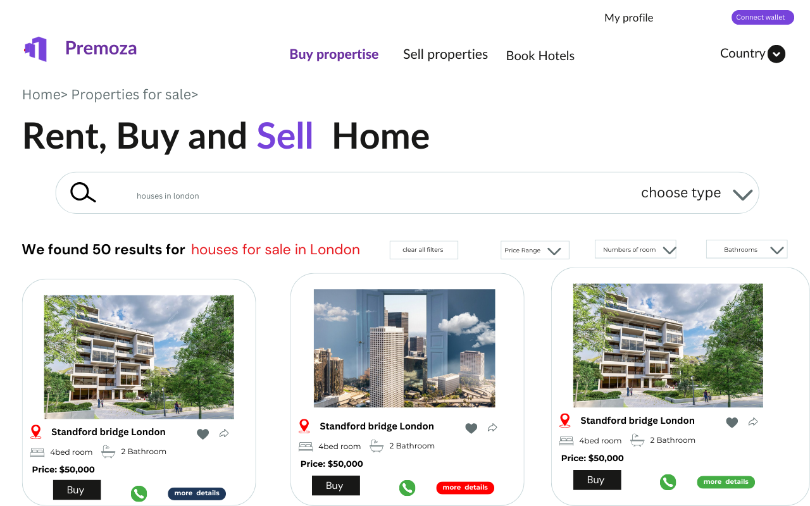

# Premoza

A cutting-edge real estate e-commerce platform, built on Solana blockchain, allowing users to buy, rent, or sell properties and book hotels worldwide with a single click.

 

We are focused on leveraging smart contracts to address significant real estate challenges worldwide. Our platform enables seamless payments for rental services and hotel bookings using Premoza. Additionally, we offer real estate developers the ability to tokenize assets, facilitating the sale and transfer of ownership documents on-chain. Users who pay for premium services will also receive an NFT receipt as proof of transaction.

# Why Solana Blockchain

We are building a real estate e-commerce platform on Solana to leverage the unique strengths of each blockchain.Solana, with its high throughput and low transaction fees, allows us to provide a seamless, fast, and affordable user experience for real-time interactions and payments. By utilizing the blockchain, we can create a platform that combines the best of decentralization, security, scalability, and performance for our users.

