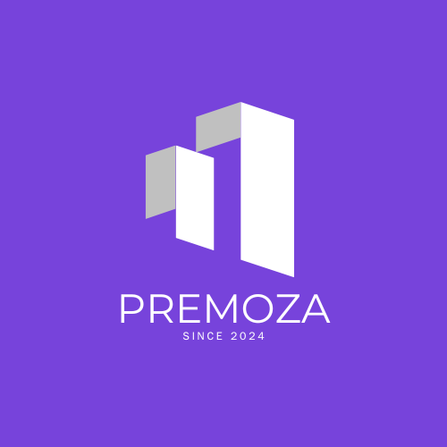

# Premoza

An innovative real estate e commerce platform powered by Solana and Starknet, enabling users to,buy, rent or sell properties and book hotels from anywhere in the world with just one click.

we focusing on utilizing blockchain technology to help solve major real estate problems across the globe, seamlessly make payment for rental services and hotel booking using Premoza 

# Why Solana and Starknet

We are building our real estate e-commerce platform on both Starknet and Solana to leverage the unique strengths of each blockchain. Starknet offers the security and scalability of Ethereum through ZK-Rollups, ensuring that high-value real estate transactions are secure and cost-effective. Solana, with its high throughput and low transaction fees, allows us to provide a seamless, fast, and affordable user experience for real-time interactions and payments. By utilizing both blockchains, we can create a platform that combines the best of decentralization, security, scalability, and performance for our users.

